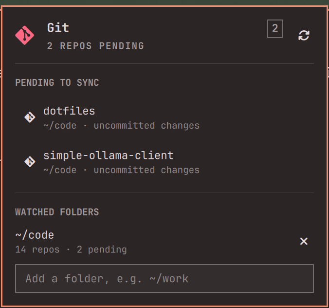

# git-status-indicator

An [Omarchy](https://omarchy.org/) bar plugin that warns you when any git
repository under a set of watched folders has work pending to be
synchronized with its remote: uncommitted changes, untracked files, or
unpushed commits.

The bar shows a single git glyph, in your theme's foreground when
everything is clean and in the theme's urgent color when something is
pending. The popup lists the repositories that need attention — clicking
one opens lazygit there — and the watched folders themselves, which you add
and remove from inside the panel. There is no configuration file.



## Behavior

A repository is considered "pending" if any of the following is true:

- `git status --porcelain` is non-empty (uncommitted or untracked changes).
- The current branch has commits ahead of its configured upstream.
- The current branch has **no** upstream configured **and** `HEAD` is not
  reachable from any remote tracking ref. This catches the case where you
  pushed with `git push origin main` instead of `git push -u origin main`
  but everything is still on the remote — the script correctly treats
  that as synced.

## Install

```bash
omarchy plugin add https://github.com/nachoaz/git-status-indicator.git --enable
```

Or, if you keep it in your dotfiles, symlink the checkout into the plugins
directory and rescan:

```bash
ln -sfn ~/code/git-status-indicator ~/.config/omarchy/plugins/nachoaz.git-status
omarchy-shell shell rescanPlugins
omarchy plugin enable nachoaz.git-status right
```

Dependencies: `git`, `jq`, `find`, and `lazygit` for the row click — all
present on a stock Omarchy.

## Configuration

Watched folders are managed from the panel itself: type a path into the
field at the bottom to add one, click the `×` on a folder to stop watching
it. Each folder shows how many repositories it holds and how many of them
are pending, so a typo shows up as "does not exist" on its own row.

Everything is stored in the widget's entry in `~/.config/omarchy/shell.json`
and is also editable from the bar's widget settings UI:

| Key                  | Default  | What it does                                                      |
| -------------------- | -------- | ----------------------------------------------------------------- |
| `watchDirs`          | `~/code` | Comma-separated folders to scan. `~` expands to your home folder. |
| `maxDepth`           | `4`      | How deep to look for `.git` directories under each folder.        |
| `refreshIntervalSec` | `60`     | Seconds between scans.                                            |

```json
{ "id": "nachoaz.git-status", "watchDirs": "~/code, ~/work", "maxDepth": 3 }
```

## Interactions

| Input        | Action                             |
| ------------ | ---------------------------------- |
| Left click   | Open the popup                     |
| Right click  | Rescan now                         |
| `↑` / `↓`    | Move between pending repositories  |
| `Enter`      | Open lazygit for that repository   |
| `r`          | Rescan                             |
| `Esc`        | Close                              |
| Type + `↵`   | Add a watched folder               |
| `×`          | Stop watching that folder          |

IPC, for scripts and keybinds:

```bash
omarchy-shell nachoaz.git-status toggle
omarchy-shell nachoaz.git-status refresh
omarchy-shell nachoaz.git-status status         # -> "4 repos pending"
omarchy-shell nachoaz.git-status watch '~/work'
omarchy-shell nachoaz.git-status unwatch '~/work'
```

## How it works

`core/git-status.sh` takes a depth and a list of folders, walks every
`.git` directory below them, and runs cheap **local** git commands per
repository — no network, no auth:

```bash
git -C <repo> status --porcelain                # working tree
git -C <repo> rev-list --count '@{u}..HEAD'     # commits ahead of upstream
git -C <repo> branch -r --contains HEAD         # fallback when no upstream
```

It prints one JSON object on stdout:

```json
{
  "state": "unsynced",
  "scanned": 13,
  "pending": [
    { "name": "dotfiles", "path": "/home/me/code/dotfiles",
      "dir": "~/code", "issues": "uncommitted changes" }
  ],
  "watched": [
    { "path": "~/code", "state": "ok", "repos": 13, "pending": 1 }
  ]
}
```

`Panel.qml` schedules that script and draws the result. The script is
standalone, so it also works from any other status bar — point the bar's
exec at `core/git-status.sh 4 ~/code` and parse the JSON.

`./core/git-status.test.sh` builds throwaway repositories for each branch of
that decision — no remote, pushed without `-u`, ahead of upstream, untracked
files, a missing folder — and asserts the verdict and the per-folder counts.

## Notes

- **Scan cost.** Each tick runs `git status` and `git rev-list` once per
  repository. Local and cheap, but a very large `watchDirs` with a deep
  `maxDepth` costs more; raise `refreshIntervalSec` if you notice it.
- **Untracked files count.** `git status --porcelain` reports untracked
  files, so a brand-new file in any watched repo turns the icon urgent.
- **Current branch only.** A side branch with unpushed commits does not
  trigger the indicator if the checked-out branch is clean.

## License

[MIT](./LICENSE).
